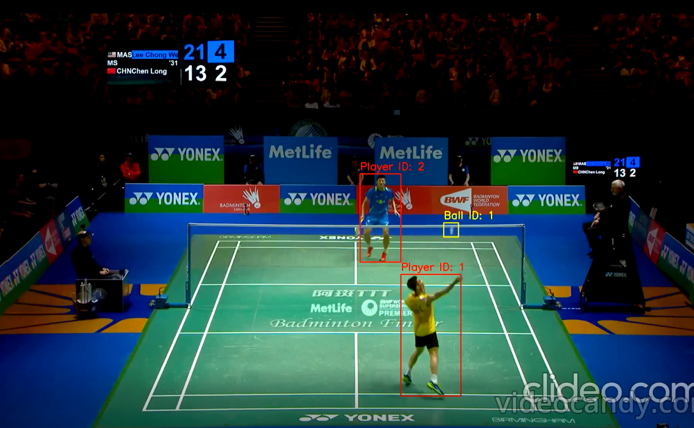

# Badminton Analysis Demo

### Detection Example  

## Introduction  
This is a badminton analysis and detection project based on YOLO. The project is still under development, and some bugs remain unresolved.  

## Dataset and References  
- Dataset: [Badminton Shuttle Detection](https://universe.roboflow.com/personal-2xh62/badminton-shuttle-detection/dataset/2/images)  
- Code Reference: [Tennis Analysis](https://github.com/abdullahtarek/tennis_analysis)  

## Features  
- Detects the position of the badminton shuttl.  
- More features will be added in the future.  

## Current Status  
- the training on the dataset is not properly enough need to be fix  
- choose player need to be improved

## Pretrained Model
you can get pretrained model about balls(based on yolo5) from this link
best:https://drive.google.com/file/d/10UPkLCntBz5UTIfqIQ3oSPeVGSXLF4yg/view?usp=sharing
last:https://drive.google.com/file/d/1V0R-2RUyxnlRdQogXr3BeMIxfmc5LF_c/view?usp=sharing
